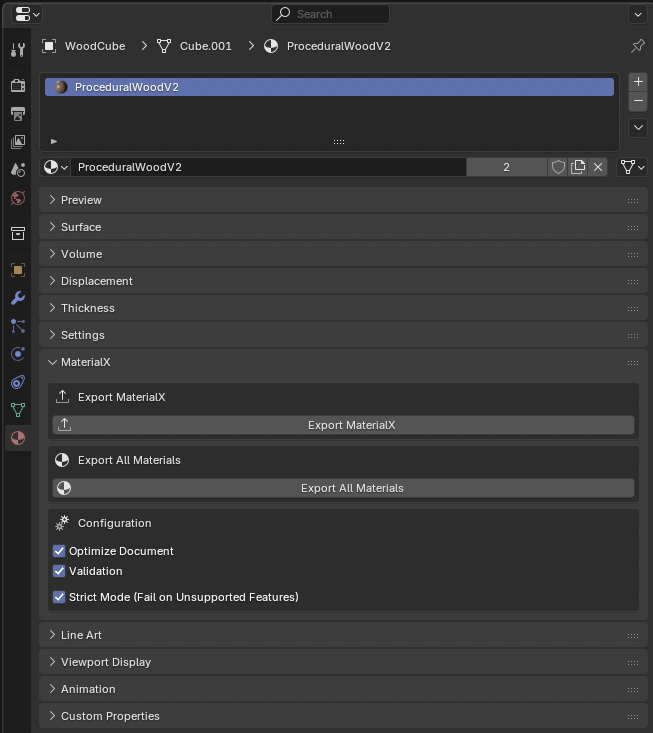

# MaterialX Export for Blender

A professional-grade Blender addon to export Blender materials to MaterialX (.mtlx) format with comprehensive node support and validation.

## 🚀 Features

- **MaterialX 1.39 Compliance**: Full compliance with latest MaterialX specification
- **35+ Supported Node Types**: Comprehensive Blender node support including Principled BSDF, textures, math operations, and utilities
- **Blender Addon UI**: Export single or all materials from the Blender UI
- **Command-Line Export**: Export materials from any `.blend` file without opening Blender
- **Texture Export**: Export and copy textures with relative/absolute path support
- **Advanced Validation**: Built-in MaterialX document validation with detailed error reporting
- **Configuration Panel**: In-UI configuration for export settings



## 📦 Installation

### Manual Installation

1. Copy the `materialx_addon/` directory to your Blender addons directory:

   - **macOS**: `~/Library/Application Support/Blender/VERSION/scripts/addons/`
   - **Windows**: `%APPDATA%\Blender Foundation\Blender\VERSION\scripts\addons\`
   - **Linux**: `~/.config/blender/VERSION/scripts/addons/`

2. Enable the addon in Blender: `Edit > Preferences > Add-ons`, search for "MaterialX Export"

### Development Installation (macOS)

```bash
python3 deploy.py
```

**Important**: Run this script after making code changes to deploy updates to Blender.

## 🎮 Usage

### In Blender

- Access the MaterialX panel in `Properties > Material > MaterialX`
- Export the selected material or all materials
- Configure export settings in the Configuration panel
- View real-time export status

### Command-Line

```bash
python cmdline_export.py <blend_file> <material_name> <output_mtlx_file> [options]
```

**Options:**

- `--export-textures` : Export texture files
- `--texture-path PATH` : Directory to export textures to
- `--version VERSION` : MaterialX version (default: 1.39)
- `--relative-paths` : Use relative paths for textures
- `--copy-textures` : Copy texture files

## 🧩 Supported Node Types

### Core Material Nodes

- **Principled BSDF** → `standard_surface` (with full parameter support)
- **Image Texture** → `image` (with texture coordinate support)
- **Texture Coordinate** → `texcoord` (with multiple coordinate types)

### Math and Color Nodes

- **RGB, Value** → `constant` (color3/float)
- **Math, Vector Math** → `math`, `vector_math` (with all operations)
- **Mix** → `mix` (with proper parameter mapping)
- **Invert, Separate/Combine Color** → `invert`, `separate3`, `combine3`

### Texture Nodes

- **Checker, Gradient, Noise, Wave** → `checkerboard`, `ramplr`, `noise2d`, `wave`
- **Brick Texture** → `brick` (with mortar and brick pattern support)
- **Musgrave Texture** → `musgrave` (fractal noise texture)

### Utility Nodes

- **Normal Map, Bump** → `normalmap`, `bump`
- **Mapping, Layer, Add, Multiply** → `place2d`, `layer`, `add`, `multiply`
- **Color Ramp, HSV/RGB conversion** → `ramplr`, `hsvtorgb`, `rgbtohsv`
- **Geometry Info** → `position` (position, normal, tangent data)
- **Object Info** → `constant` (object-specific data)
- **Light Path** → `constant` (light path information)

## 📊 Export Results

The exporter returns comprehensive results including:

- Export success status and error messages
- List of unsupported nodes with helpful suggestions

- MaterialX validation results
- File output path and optimization status

## 🧪 Testing

### Comprehensive Test Suite

Run the complete test suite (deploys addon and runs all tests):

```bash
python3 run_tests.py
```

### Unit Tests Only

Run unit tests within Blender's environment:

```bash
python3 unit_tests.py
```

### Integration Tests

Run integration tests (requires Blender with addon installed):

```bash
python3 integration_tests.py
```

### Test Coverage

The test suite includes comprehensive coverage for:

- **Exporters**: Base, Material, Batch, and Texture exporters
- **Mappers**: Node mapping and conversion functionality
- **Core Components**: Document management, validation, type conversion
- **Utilities**: Node utilities, logging
- **Configuration**: Node mappings and settings
- **Integration**: Blender and MaterialX library integration

### Test Structure

```
materialx_addon/tests/
├── test_utils.py          # Test framework and utilities
├── test_node_utils.py     # Node utility tests
├── test_logging.py        # Logging system tests

├── test_exporters.py      # Exporter component tests
├── test_mappers.py        # Mapper component tests
└── test_core.py          # Core component tests
```

### Running Tests in Blender

#### Quick Test Runner

For quick testing in Blender's Python console:

```python
# Run the quick test runner
exec(open('/path/to/blender_test_runner.py').read())

# Or run specific functions
run_quick_tests()                    # Basic functionality tests
run_full_tests()                     # Complete test suite
test_specific_component('exporters') # Test specific component
```

#### Direct Test Execution

To run tests directly in Blender's Python console:

```python
# Import and run all tests
from materialx_addon.tests import run_all_tests
results = run_all_tests()
print(f"Tests passed: {results['passed']}/{results['total_tests']}")

# Run specific test modules
from materialx_addon.tests.test_exporters import create_exporter_tests
from materialx_addon.tests.test_utils import TestRunner

runner = TestRunner()
runner.add_tests(create_exporter_tests())
results = runner.run_tests()
```
